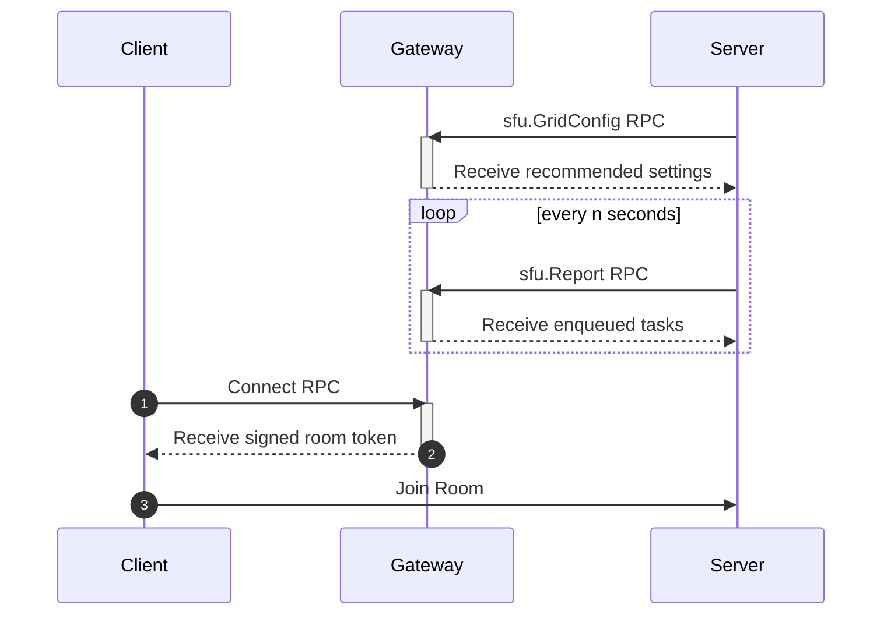

# ODIN Gateway


This is a simple gateway server written in Deno. It regulates access by
spreading ODIN clients over available ODIN servers based on current and future
usage. It also performs basic checks on customer license conditions.



## Setup Development Environment

The following prerequisites are necessary to start development:

- [Deno](https://deno.land/#installation)

## How to Start

```shell
# start a HTTP server on port 7000
deno task run

# start a HTTPS server on port 7000
deno task run --ssl
```

**Note:** If you don't want to install Deno on the target system, you can also
compile the scripts into a self-containing executable. Click
[here](https://deno.land/manual/tools/compiler) for details.

## Configuration

The gateway is configured using a TypeScript configuration file
([config.ts](https://github.com/4Players/odin-gateway/blob/main/config.ts)). In
addition, the following optional command-line arguments are available to enforce
specific options:

| Option          | Description                      |
| :-------------- | :------------------------------- |
| `--host`        | The IP address to listen on      |
| `--port`        | The TCP port number to listen on |
| `--ssl`         | Enable HTTPS                     |
| `--certificate` | The certificate file to use      |
| `--privatekey`  | The private key file to use      |

**Note:** For local testing, using
[mkcert](https://github.com/FiloSottile/mkcert) is recommended.

### Importing Customer Keys

Instead of providing a static list of customer keys in the gateway configuration
file, you can also write your own custom import function, which needs to return
a `Promise<Customer[]>` value.

```typescript
customerApi: {
  updateFunction: myFunction, // async function returning a list of customers
  updateInterval: 300,        // interval in seconds
},
```

This function can be used to either fetch your customer keys from a RESTful API
or a reload file on disk. Here's an example:

```typescript
async function myFunction(): Promise<Customer[]> {
  try {
    const response = await fetch("https://domain.tld/api/customer-keys");
    if (response.status !== 200) {
      throw "something went wrong";
    }
    return await response.json();
  } catch (_e) {
    // handle error
  }
  return [];
}
```

## Public API

### Authentication

Authentication for the public API is done using a `Bearer` token signed with an
ODIN access key. When specified, the
[audience](https://www.rfc-editor.org/rfc/rfc7519#section-4.1.3) claim (aud) in
the token must be set to `gateway`. The payload of a decoded JWT looks like
this:

```json
{
  "rid": "foo",
  "uid": "bar",
  "aud": "gateway",
  "sub": "connect",
  "exp": 1669852860,
  "nbf": 1669852800
}
```

For details on generating tokens, please refer to
[@4players/odin-tokens](https://github.com/4Players/odin-tokens).

### RPC Methods

To use any of the following methods, the JWT used to authorize must have its
name listed in the
[subject](https://www.rfc-editor.org/rfc/rfc7519#section-4.1.2) claim (sub).

#### Connect

Authorizes ODIN clients to access the room specified in the `Bearer` token and
responds with a new JWT signed with the gateway master key, which can be used to
join a room on an attached ODIN server.

```shell
curl --request POST \
  --url http://localhost:7000/ \
  --header 'Authorization: Bearer ${JWT}' \
  --header 'Content-Type: application/json' \
  --data '{
    "jsonrpc": "2.0",
    "method": "Connect",
    "params": {},
    "id": 1
  }'
```

#### RoomClose

Closes the specified room (if available) and prevents it from being joined again
until `ban_time` is expired.

```shell
curl --request POST \
  --url http://localhost:7000/ \
  --header 'Authorization: Bearer ${JWT}' \
  --header 'Content-Type: application/json' \
  --data '{
    "jsonrpc": "2.0",
    "method": "RoomClose",
    "params": {
      "room_id": "${ROOM_ID}",
      "ban_time": ${OPTIONAL_TIME_IN_SECONDS},
    },
    "id": 1
  }'
```

#### RoomUpdate

Updates the global user data of the specified room using the given `user_data`
byte array.

```shell
curl --request POST \
  --url https://localhost:7000/ \
  --header 'Authorization: Bearer ${JWT}' \
  --header 'Content-Type: application/json' \
  --data '{
    "jsonrpc": "2.0",
    "method": "RoomUpdate",
    "params": {
      "room_id": "${ROOM_ID}",
      "user_data": ${ARRAY_OF_BYTES}
    },
    "id": 1
  }'
```

#### RoomBanClient

Kicks all clients matching the specified `user_id` from the specified room and
prevents them from joining again until `ban_time` is expired.

```shell
curl --request POST \
  --url http://localhost:7000/ \
  --header 'Authorization: Bearer ${JWT}' \
  --header 'Content-Type: application/json' \
  --data '{
    "jsonrpc": "2.0",
    "method": "RoomBanClient",
    "params": {
      "room_id": "${ROOM_ID}",
      "user_id": "${PEER_USER_ID}",
      "ban_time": ${OPTIONAL_TIME_IN_SECONDS},
    },
    "id": 1
  }'
```

#### RoomSendMessage

Sends arbitrary data to all clients matching the specified `user_id` in the
specified room.

```shell
curl --request POST \
  --url https://localhost:7000/ \
  --header 'Authorization: Bearer ${JWT}' \
  --header 'Content-Type: application/json' \
  --data '{
    "jsonrpc": "2.0",
    "method": "RoomSendMessage",
    "params": {
      "room_id": "${ROOM_ID}",
      "user_id": "${PEER_USER_ID}",
      "message": ${ARRAY_OF_BYTES}
    },
    "id": 1
  }'
```
